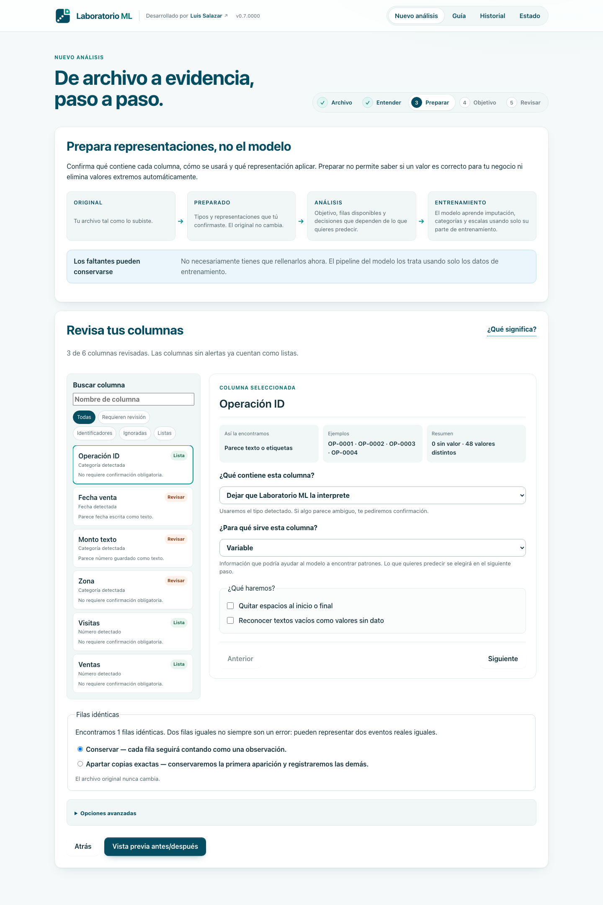
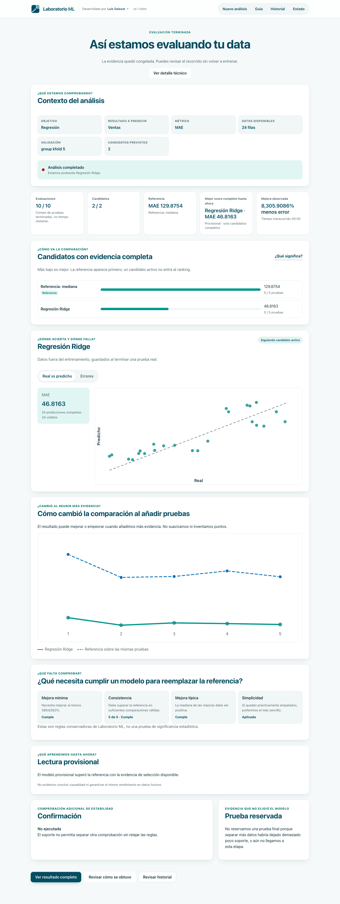
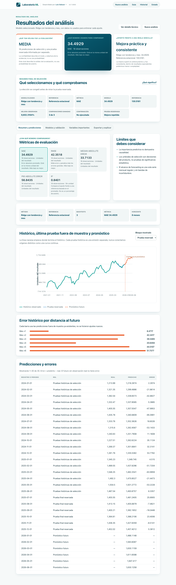

# Laboratorio ML · v1.0.0004

¿Tienes un Excel y quieres probar machine learning, pero no sabes por dónde empezar?

Sube tu data, dinos qué quieres estimar o entender y la aplicación revisará su calidad, preparará las variables, comparará modelos y te explicará los resultados.

El análisis corre localmente en tu equipo y no necesitas una API key.

La identidad visual (símbolo, variantes y tamaños de uso), los tokens y el estado de licencia de Mont están documentados en [Identidad visual](docs/VISUAL_IDENTITY.md).

## Qué puedes hacer

- Explorar Excel (.xlsx), CSV y Parquet con tipos primitivos. Excel es el camino principal.
- Crear versiones preparadas auditables con un editor guiado por columna, preview antes/después, filas apartadas y receta reutilizable.
- Estimar un valor, predecir categorías o pronosticar una serie mensual regular.
- Comparar referencias simples, modelos lineales y árboles con particiones congeladas, criterios visibles de mejora y consistencia, y confirmación secundaria cuando aplica.
- Observar candidatos, métricas, trayectorias y gráficos reales por evaluación mientras el run continúa; después se puede reproducir el recorrido sin reentrenar.
- Revisar calidad, exclusiones, métricas, candidatos fallidos y límites.
- Explorar variables numéricas con correlaciones, scatterplots y boxplots calculados localmente sobre una muestra determinista.
- Ver qué variables aportaron más a la predicción y probar escenarios interactivos con la forma real del modelo seleccionado, lineal o no lineal, dentro de los rangos observados.
- Exportar Excel, PDF y contexto TXT/Markdown/JSON para cualquier IA.
- Reabrir el historial persistente después de reiniciar.

## Demo visual

Capturas tomadas de la instalación Docker verificada, sin mockups:










## Quick start

El instalador levanta los servicios, ejecuta una prueba sintética y abre la aplicación. Python y Node quedan dentro de Docker. Usa solo el comando de tu sistema operativo:

macOS con o sin Docker:

```bash
sh scripts/setup.sh --install-docker
```

Windows PowerShell con o sin Docker Desktop:

```powershell
powershell -ExecutionPolicy Bypass -File scripts/setup.ps1 -InstallDocker
```

En Windows, la opción `-InstallDocker` instala Docker Desktop solo si falta. Para su backend predeterminado de contenedores Linux también habilita WSL 2 si falta, pero usa `--no-distribution`: no instala Ubuntu ni otra distribución Linux.

En Linux instala Docker Engine con el plugin Compose correspondiente a tu distribución y ejecuta:

```bash
sh scripts/setup.sh
```

No hace falta `.env`, Python, Node, Git ni OpenAI. Los instaladores conservan los datos, esperan a que Docker esté listo y eligen otro puerto automáticamente si el 3000 está ocupado.

## Instalación asistida por IA

Pásale la URL de este repositorio a Codex, Claude u otra IA con acceso al equipo y dile: **“Déjalo listo”.** No necesitas instalar nada antes.

Para que no se detenga por permisos, activa para esta tarea el acceso a terminal, red e instalación de aplicaciones. En Codex, la opción se llama **Full access**; en otros asistentes usa el permiso equivalente. Hazlo solo si confías en este repositorio y vuelve a tu configuración habitual al terminar.

La IA debe detectar primero el sistema operativo y hacer como máximo **una sola pregunta**. En esa pregunta reúne únicamente la autorización que corresponda: Docker Desktop en macOS; Docker Desktop y el componente WSL 2 sin distribución Linux en Windows; o Docker Engine con Compose en Linux. También puede incluir aceptar los términos del instalador oficial, usar elevación administrativa y reiniciar si Windows lo exige. Después del `sí`, no debe pedir nuevas confirmaciones. Una ventana protegida de macOS o Windows para contraseña/UAC no cuenta como otra pregunta: solo hay que aceptarla. Si Windows se reinicia, `continúa` reanuda la misma autorización.

Después de obtener el repo —con Git si ya existe o como ZIP si no— la IA solo debe ejecutar:

```bash
# macOS
sh scripts/setup.sh --install-docker
```

```powershell
# Windows
powershell -ExecutionPolicy Bypass -File scripts/setup.ps1 -InstallDocker
```

```bash
# Linux, después de instalar Docker Engine + Compose si faltan
sh scripts/setup.sh
```

En macOS y Windows, los scripts detectan la arquitectura e instalan Docker Desktop desde el sitio oficial solo si falta. Solo en Windows habilitan o actualizan WSL 2, sin instalar una distribución Linux. En Linux reutilizan Docker Engine y Compose del propio sistema. Luego inician o comprueban el motor, buscan un puerto libre, construyen la app, ejecutan el smoke y abren o indican la URL. No instalan Git, Python ni Node y no borran datos. Si Windows necesita reinicio, la IA debe volver a ejecutar el mismo comando después de reiniciar.

Prompt recomendado:

> Obtén este repositorio y déjalo listo. Detecta primero el sistema operativo y revisa si tienes acceso a terminal, red e instalación. Si te falta autorización, haz una única pregunta e incluye solo lo necesario para ese sistema: Docker Desktop en macOS; Docker Desktop y WSL 2 sin instalar Ubuntu ni otra distribución Linux en Windows; Docker Engine con Compose en Linux. Incluye términos oficiales, elevación y reinicio solo cuando correspondan. Después de mi sí, no vuelvas a pedirme confirmación. Usa exactamente el comando del README para ese sistema; en Linux no uses `--install-docker`. Continúa tras un reinicio, completa el smoke y abre o indica la aplicación. No instales Git, Python ni Node, no borres datos y no termines antes de que la app funcione o exista un bloqueo externo concreto.

## Flujo de uso

1. Sube tu Excel o archivo de datos, o elige uno de los seis ejemplos sintéticos.
2. Revisa cómo se interpretaron columnas, faltantes, IDs y duplicados.
3. En **Preparar**, revisa una columna a la vez, confirma qué contiene, para qué sirve y cómo interpretarla; el original no cambia.
4. Elige el resultado que quieres predecir; para pronóstico, también fecha, horizonte y, solo si corresponde, agregación mensual.
5. Revisa el preflight y ejecuta.
6. Observa evaluaciones reales en vivo y después compara selección, prueba reservada, referencia, métricas y drivers; en regresión o clasificación puedes mover entradas y en pronóstico recorrer el horizonte ya calculado, sin modificar la corrida.

El flujo es **Original → Preparado → Análisis → Entrenamiento**. Preparar no significa que Laboratorio ML pueda saber si tus datos son correctos para tu negocio. Las transformaciones que aprenden de los datos continúan ocurriendo únicamente dentro del entrenamiento para evitar fugas.

La confiabilidad resume la solidez de la evaluación; no es una probabilidad de acierto. La referencia muestra qué se logra sin usar variables: mediana o promedio en números, clase frecuente en categorías y, para una serie, la mejor pauta histórica simple disponible (último valor, media histórica o estacional). Se construye dentro de cada entrenamiento y se mide en los mismos casos apartados que cada modelo. Para reemplazarla, un candidato completo necesita una mejora mínima (3 % menos error, o 0,02 más en métricas de acierto/ajuste), al menos tres comparaciones, victorias en 60 % o más y una diferencia típica favorable; los empates prácticos favorecen el método más simple. En modo recomendado, el provisional debe repetir la mejora en 2 de 3 separaciones nuevas. Son reglas conservadoras del producto, no pruebas de significancia. La importancia se calcula fuera del train de cada fold, no decide retrospectivamente el ganador y no demuestra causalidad.

## Privacidad y OpenAI opcional

El núcleo funciona offline después de descargar imágenes y dependencias. Los archivos viven en el volumen Docker local. No hay trackers ni salida externa por defecto. La vista previa y copia del contexto offline están disponibles; esta versión todavía no realiza envíos directos a OpenAI ni almacena API keys.

## Exportaciones

El Excel preparado contiene datos activos, filas apartadas, transformaciones, comparación de calidad y diccionario en lenguaje humano. Los reportes del análisis explican Original, Preparado, Análisis y Entrenamiento. Todos nacen de snapshots inmutables.

## Limitaciones y qué no hace

V1 no combina tablas, reproduce Power Query, hace pivots, fuzzy dedupe ni elimina outliers automáticamente. Tampoco ofrece inferencia por lotes, clustering, calibración formal, intervalos conformales, SHAP, tuning Optuna completo, GPU, deep learning, multiusuario, despliegue público ni causalidad. El simulador interactivo proyecta con un reajuste local del modelo seleccionado dentro de rangos observados: no es una nueva evaluación, una intervención causal ni una garantía futura. Forecasting acepta una sola serie mensual regular sin covariables; exige calendario continuo, no rellena huecos y permite sumar o promediar observaciones del mes solo para ese análisis. La validación tabular supone registros independientes: grupos, entidades repetidas y usos temporales no están soportados. Consulta [ROADMAP](docs/ROADMAP.md).

## Probar sin usar tus propios datos

La pantalla de ejemplos ofrece seis recorridos Excel-first. El sexto enseña a preparar una fecha DMY, un monto con coma decimal, un ID, espacios, faltantes y un duplicado exacto antes de una regresión. Cada workbook tiene una hoja `Datos` y una hoja `Guía`; la configuración recomendada se muestra antes de ejecutar y puede modificarse.

`examples/` contiene únicamente datos sintéticos reproducibles con semilla fija. CSV y Parquet se conservan para pruebas de formato y CI. Regenera los archivos con `cd backend && uv run python ../scripts/generate_examples.py`.

## Excel y formatos soportados

La estructura recomendada es una tabla con una fila por observación, una columna por variable y encabezados claros. Puedes elegir hoja y fila real de encabezados. La app no interpreta diseño visual, no ejecuta macros ni corrige automáticamente todos los errores de la data. `.xls` antiguo no está soportado; guárdalo como `.xlsx` desde Excel antes de subirlo.

## Datasets públicos para seguir practicando

El Home, el primer paso y la sección [Guía](http://127.0.0.1:3000/guide#datasets) enlazan UCI y la Plataforma Nacional de Datos Abiertos del Perú. Son referencias externas: la app no descarga ni envía datos automáticamente y ningún dataset está garantizado para funcionar sin preparación.

## Versión

`version.json` es la fuente de verdad de la release visible `MAJOR.MINOR.BUILD`; BUILD usa cuatro dígitos. Su `semver` se sincroniza con los paquetes backend y frontend. MAJOR requiere una generación incompatible aprobada, MINOR agrega una feature compatible y BUILD corrige de forma compatible. Los cambios solo documentales no publican versión. Verifica mirrors con `python3 scripts/check_version.py`.

## FAQ

**¿Necesito saber machine learning?** No. El wizard parte de tu pregunta y explica los términos.

**¿Necesito una API key?** No. Esta versión no envía datos directamente a OpenAI.

**¿Mis datos salen del equipo?** No. La aplicación genera una proyección revisable para que decidas si la copias a otra herramienta.

**¿Por qué ganó una referencia sencilla?** Porque ningún candidato completo superó, en los mismos casos apartados, la mejora mínima y la consistencia exigidas: 3 % menos error o 0,02 más de acierto/ajuste, al menos tres comparaciones, 60 % de victorias y mediana favorable. Si hubo confirmación, el provisional tampoco repitió la mejora en al menos 2 de 3 separaciones nuevas. Esto no demuestra que no exista señal.

**¿Por qué no hay R² o ROC?** Algunas métricas no son válidas con un resultado constante, una sola clase o soporte insuficiente; se muestran como no disponibles con motivo.

**¿Por qué no aparecen bandas?** Requieren calibración separada y suficientes errores históricos por horizonte.

**¿Qué significa poca data?** Que hay pocas observaciones para comprobar si el patrón se repite; el resultado se marca exploratorio.

**¿Por qué se excluyó una columna?** IDs, texto libre, columnas vacías/constantes o variables no disponibles pueden excluirse con un motivo auditable.

**¿Importancia significa causalidad?** No. Solo indica ayuda predictiva bajo esa evaluación.

**¿Por qué una accuracy alta puede engañar?** Acertar siempre la clase frecuente puede ignorar por completo la minoritaria.

**¿Puedo cerrar el navegador?** Sí. El worker continúa y el progreso se recupera desde eventos persistentes.

**¿Cómo recupero el historial?** Abre Historial; el volumen persiste tras `docker compose down`.

**¿Cómo borro mis datos?** En Estado puedes borrar elementos por separado o usar **Borrar datos guardados** para eliminar uploads, versiones, corridas, reportes e historial de una sola vez. La acción pide confirmación, se bloquea si existen trabajos activos y conserva la aplicación, su configuración y la estructura de almacenamiento.

**¿Qué ocurre si se cancela un modelo?** El worker termina el proceso de análisis y sus descendientes dentro de un límite acotado. El job queda `cancelled`, no `failed`, y nunca publica un parcial como completo.

**¿Evaluación y forecast futuro son lo mismo?** No. Evaluación compara contra datos conocidos fuera de train; forecast futuro no tiene valor real disponible todavía.

## Diagnóstico, desarrollo y contribución

Ejecuta `scripts/doctor.ps1` o `scripts/doctor.sh`. Para instalación y pruebas, consulta [SETUP](docs/SETUP.md), [TESTING](docs/TESTING.md) y [TROUBLESHOOTING](docs/TROUBLESHOOTING.md). Las contribuciones siguen [CONTRIBUTING.md](CONTRIBUTING.md). Licencia MIT para el código original; dependencias conservan sus licencias.

## Plataformas verificadas

- macOS Apple Silicon (`arm64`, Apple M1): build, Compose, regresión, clasificación, forecast, cancelación, exportaciones y reinicio verificados el 30-09-2026.
- Linux `amd64`: verificado por CI en cada PR/push a `master`.
- Windows — ASUS ROG Strix G16 G614JIR (Intel Core i9-14900HX, NVIDIA RTX 4070): arranque y uso local verificados físicamente por el autor el 04-10-2026. Es evidencia de ese equipo, no una declaración de compatibilidad universal con Windows.

El cierre reproducible de cada hallazgo está en [AUDIT_2026-09-30](docs/AUDIT_2026-09-30.md).
