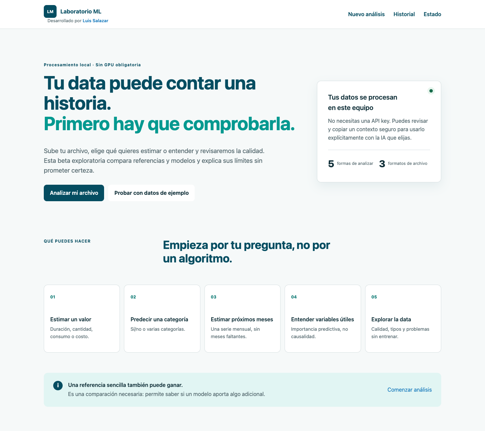
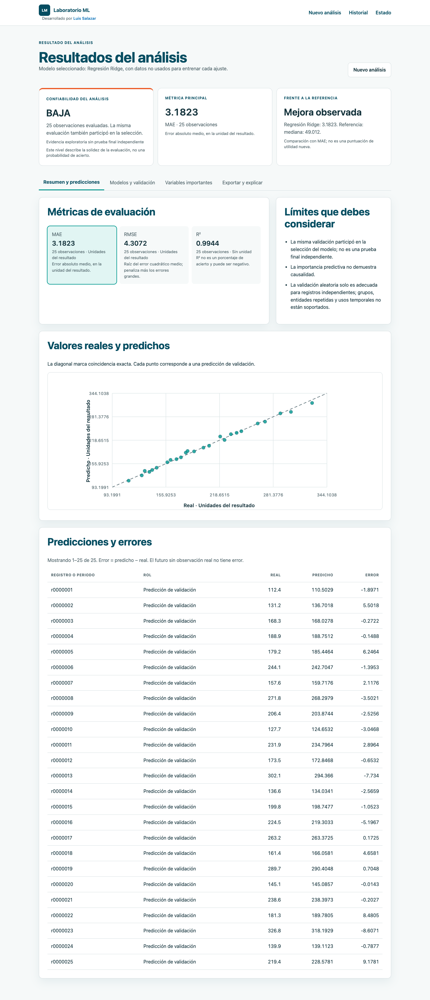
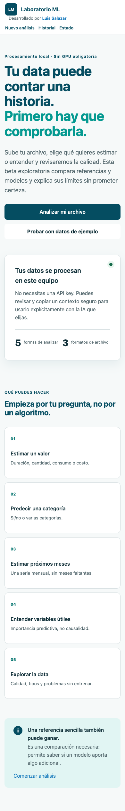

# Laboratorio ML

¿Tienes un Excel y quieres probar machine learning, pero no sabes por dónde empezar?

Sube tu data, dinos qué quieres estimar o entender y la aplicación revisará su calidad, preparará las variables, comparará modelos y te explicará los resultados.

El análisis corre localmente en tu equipo y no necesitas una API key.

La identidad visual, los tokens y el estado de licencia de Mont están documentados en [Identidad visual](docs/VISUAL_IDENTITY.md).

## Qué puedes hacer

- Explorar CSV, XLSX y Parquet con tipos primitivos.
- Estimar un valor, predecir categorías o pronosticar una serie mensual regular.
- Comparar referencias simples, modelos lineales y árboles.
- Revisar calidad, exclusiones, métricas, candidatos fallidos y límites.
- Exportar Excel, PDF y contexto TXT/Markdown/JSON para cualquier IA.
- Reabrir el historial persistente después de reiniciar.

## Demo visual

Capturas tomadas de la instalación Docker verificada, sin mockups:







## Quick start

Requiere Docker Desktop/Engine con Compose v2 y al menos 4 GiB disponibles para la primera construcción.

```bash
docker compose up --build
```

Abre [http://localhost:3000](http://localhost:3000). No hace falta `.env` ni OpenAI. En segundo plano usa `docker compose up -d`; consulta estado con `docker compose ps`; apaga sin borrar datos con `docker compose down`.

En Windows también puedes ejecutar `powershell -ExecutionPolicy Bypass -File scripts/setup.ps1`. El script no cambia la política global.

## Flujo de uso

1. Sube un archivo o elige un ejemplo sintético.
2. Revisa cómo se interpretaron columnas, faltantes, IDs y duplicados.
3. Elige una pregunta y target; para forecasting, también fecha y horizonte.
4. Revisa el preflight y ejecuta.
5. Compara confiabilidad, referencia, métricas, drivers y exportaciones.

La confiabilidad resume la solidez de la evaluación; no es una probabilidad de acierto. Una referencia sencilla puede ganar. La importancia se calcula fuera del train de cada fold, pero esa validación también participa en la selección y no demuestra causalidad.

## Privacidad y OpenAI opcional

El núcleo funciona offline después de descargar imágenes y dependencias. Los archivos viven en el volumen Docker local. No hay trackers ni salida externa por defecto. La vista previa y copia del contexto offline están disponibles; esta versión todavía no realiza envíos directos a OpenAI ni almacena API keys.

## Exportaciones

Excel contiene resumen, calidad, limpieza real, configuración, candidatos, métricas, predicciones, drivers, errores, advertencias, validación y diccionario. PDF contiene métricas, gráficos, drivers y límites. Ambos nacen del mismo snapshot analítico inmutable; cada exportación tiene identidad y archivo propios.

## Limitaciones y qué no hace

V1 no ofrece inferencia por lotes, clustering, detección de anomalías por modelos, calibración formal, intervalos conformales, SHAP, tuning Optuna completo, envío directo a OpenAI, GPU, deep learning, multiusuario, despliegue público ni causalidad. Forecasting acepta una sola serie mensual regular sin covariables; exige calendario continuo, no rellena huecos y permite sumar o promediar duplicados mensuales. La validación tabular supone registros independientes: grupos, entidades repetidas y usos temporales no están soportados. Consulta [ROADMAP](docs/ROADMAP.md).

## Ejemplos

`examples/` contiene regresión, clasificación y forecast sintéticos. Nunca usa datasets privados. El script `scripts/generate_examples.py` crea XLSX/Parquet adicionales reproducibles.

## FAQ

**¿Necesito saber machine learning?** No. El wizard parte de tu pregunta y explica los términos.

**¿Necesito una API key?** No. Esta versión no envía datos directamente a OpenAI.

**¿Mis datos salen del equipo?** No. La aplicación genera una proyección revisable para que decidas si la copias a otra herramienta.

**¿Por qué ganó una referencia sencilla?** Porque los modelos probados no mejoraron claramente esa comparación bajo la evaluación usada.

**¿Por qué no hay R² o ROC?** Algunas métricas no son válidas con target constante, una sola clase o soporte insuficiente; se muestran como no disponibles con motivo.

**¿Por qué no aparecen bandas?** Requieren calibración separada y suficientes errores históricos por horizonte.

**¿Qué significa poca data?** Que hay pocas observaciones para comprobar si el patrón se repite; el resultado se marca exploratorio.

**¿Por qué se excluyó una columna?** IDs, texto libre, columnas vacías/constantes o variables no disponibles pueden excluirse con un motivo auditable.

**¿Importancia significa causalidad?** No. Solo indica ayuda predictiva bajo esa evaluación.

**¿Por qué una accuracy alta puede engañar?** Acertar siempre la clase frecuente puede ignorar por completo la minoritaria.

**¿Puedo cerrar el navegador?** Sí. El worker continúa y el progreso se recupera desde eventos persistentes.

**¿Cómo recupero el historial?** Abre Historial; el volumen persiste tras `docker compose down`.

**¿Cómo borro mis datos?** Elimina runs inactivos en Historial y datasets sin referencias en Estado. La API bloquea el borrado si existen jobs activos o análisis dependientes.

**¿Qué ocurre si se cancela un modelo?** El worker termina el proceso de análisis y sus descendientes dentro de un límite acotado. El job queda `cancelled`, no `failed`, y nunca publica un parcial como completo.

**¿Evaluación y forecast futuro son lo mismo?** No. Evaluación compara contra datos conocidos fuera de train; forecast futuro no tiene valor real disponible todavía.

## Diagnóstico, desarrollo y contribución

Ejecuta `scripts/doctor.ps1` o `scripts/doctor.sh`. Para comandos de desarrollo, invariantes y pruebas, consulta [AGENTS.md](AGENTS.md), [AI_SETUP](docs/AI_SETUP.md), [TESTING](docs/TESTING.md) y [TROUBLESHOOTING](docs/TROUBLESHOOTING.md). Contribuciones siguen [CONTRIBUTING.md](CONTRIBUTING.md). Licencia MIT para el código original; dependencias conservan sus licencias.

Prompt para asistencia:

> Obtén este repositorio usando la URL que acompaña esta solicitud. Lee AGENTS.md y docs/AI_SETUP.md. Instálalo con Docker Compose. Verifica la API, el worker, la cola y el frontend. Ejecuta el smoke test sintético pequeño. Abre la aplicación en localhost si tu entorno lo permite. No necesitas configurar OpenAI. Conserva los datos existentes. No cambies el código salvo que sea necesario para compatibilidad y explica cualquier cambio. Si Docker no está instalado, indícame los pasos oficiales necesarios. Al terminar, informa la URL, el estado real de los servicios, las pruebas ejecutadas y cualquier limitación.

## Plataformas verificadas

- macOS Apple Silicon (`arm64`, Apple M1): build, Compose, regresión, clasificación, forecast, cancelación, exportaciones y reinicio verificados el 30-09-2026.
- Linux `amd64`: verificado por CI en cada PR/push a `master`.
- Windows: scripts disponibles, pero esta versión no declara una verificación física completada.

El cierre reproducible de cada hallazgo está en [AUDIT_2026-09-30](docs/AUDIT_2026-09-30.md).
