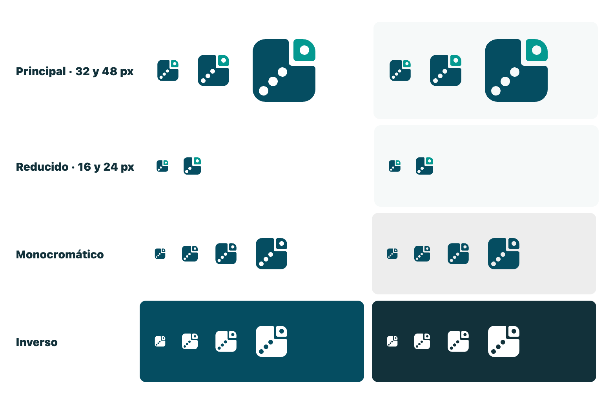

# Identidad visual de Laboratorio ML

## Marca y autoría

- Nombre visible: **Laboratorio ML**.
- Autoría: **Desarrollado por Luis Salazar**.
- El nombre enlaza al inicio. La autoría enlaza de forma independiente al perfil público de LinkedIn y no carga widgets, trackers ni recursos de LinkedIn.
- El símbolo es propio de Laboratorio ML. No deriva del logotipo de SARE ni de ningún otro logotipo existente, y sustituye al antiguo distintivo tipográfico `LM`.

## Símbolo

**Concepto: el patrón se comprueba en datos apartados.** Una hoja de datos cuadrada con una celda de la esquina separada. Tres puntos suben en diagonal dentro de la hoja y su continuación cae en la celda apartada: la idea central del producto, que un patrón encontrado en los datos solo vale si se comprueba en datos que no se usaron para encontrarlo. La pendiente es moderada a propósito: sugiere un hallazgo, no una promesa.

Construcción, en una retícula de 48 × 48:

- Hoja en azul petróleo `#054D61` y celda apartada en turquesa `#049990`. Solo dos colores, sin sombras ni degradados.
- Esquinas exteriores de radio 8 que dibujan una silueta cuadrada única; esquinas del corte de radio 2 y separación de 3 unidades.
- Los puntos son huecos recortados (`fill-rule="evenodd"`), por eso el símbolo funciona en un solo color y deja ver el fondo.
- Todos los centros están sobre la diagonal `y = 48 − x`. No depende de ninguna tipografía.

### Archivos

Viven en `frontend/public/brand/`; se sirven desde `/brand/` y no llevan scripts, imágenes incrustadas, fuentes ni recursos externos.

| Archivo | Uso |
| --- | --- |
| `laboratorio-ml-simbolo.svg` | Principal, a dos colores, sobre fondos claros. |
| `laboratorio-ml-simbolo-mono.svg` | Un solo color (azul petróleo) para impresión o sellos. |
| `laboratorio-ml-simbolo-inverso.svg` | Blanco, sobre azul petróleo u otros fondos oscuros. |
| `laboratorio-ml-simbolo-reducido.svg` | Versión simplificada para 24 px o menos: dos puntos más grandes y separaciones más anchas. |
| `laboratorio-ml-simbolo-1024.png` | PNG transparente de 1024 px para reutilizarlo donde no se admita SVG. |
| `frontend/public/favicon.svg` | Geometría reducida. Con tema oscuro del navegador, la hoja pasa a `#EDEDED`. |

### Tamaños y uso

- 32 px o más: símbolo principal. En el encabezado mide 40 px, junto al texto «Laboratorio ML».
- 24 px o menos: versión reducida. El componente `BrandSymbol` (`frontend/src/brand/`) la elige solo con `size <= 24`.
- La versión a color no se usa sobre azul petróleo ni sobre fondos oscuros: ahí va la inversa.
- Alrededor del símbolo se deja un margen libre de al menos 1/4 de su tamaño. No se rota, no se deforma ni se recolorea con otros colores de la paleta.
- Junto al nombre visible, el SVG es decorativo (`aria-hidden`) para que el lector de pantalla no anuncie dos veces «Laboratorio ML». Si aparece solo, `label` le da `role="img"` y nombre accesible.
- La geometría del componente y la de los SVG publicados es la misma; `BrandSymbol.test.tsx` falla si se separan.
- Los reportes PDF y Excel no incluían el distintivo `LM` y siguen identificándose con texto.

## Paleta original de referencia

Los siguientes colores proceden de los HEX indicados en el manual de referencia. El repositorio no incluye el manual ni sus activos.

| Uso | HEX |
| --- | --- |
| Azul petróleo | `#054D61` |
| Turquesa | `#049990` |
| Gris claro | `#EDEDED` |
| Negro | `#000000` |
| Naranja | `#EB5B27` |
| Azul | `#0871B8` |

## Tokens derivados para la interfaz

Los tonos siguientes no se presentan como colores originales del manual. Son decisiones de interfaz para fondos, estados y contraste.

- Azul petróleo oscuro `#033B4B`: hover del botón principal.
- Turquesa oscuro `#03746E`: apoyo en estados interactivos.
- Tinte turquesa `#E1F5F3`: selección y fondos informativos suaves.
- Texto principal `#12313A` y texto secundario `#52666C`.
- Fondo de página `#F6F9F9` y división `#D5DEE0`.
- Estados: éxito `#176B4B`, advertencia `#8A390E`, error `#A1261C` e información `#075E99`, cada uno acompañado por texto o etiqueta.

El botón principal usa azul petróleo con texto blanco. Turquesa y naranja se reservan para acentos, datos y avisos; no se usa texto blanco pequeño sobre esos colores.

## Tipografía

La familia solicitada es Mont. Se recibieron archivos TTF con pesos Regular, SemiBold y Bold, pero no se recibió una licencia o autorización verificable para redistribuirlos en este repositorio o incrustarlos en artifacts. Por ese motivo:

- los archivos no se copiaron ni se publicaron;
- la aplicación intenta usar una instalación local llamada `Mont` si el sistema ya la ofrece;
- el fallback explícito es `ui-sans-serif, system-ui, -apple-system, "Segoe UI", sans-serif`;
- PDF usa Helvetica incluida en el entorno Docker para no depender de fuentes instaladas en la Mac;
- Excel no incrusta fuentes.

Mont permanece **pendiente de una licencia de webfont y redistribución compatible con GitHub, Docker, PDF y las entregas previstas**. Una autorización adecuada debe indicar, como mínimo, si permite alojar los archivos con la aplicación, convertirlos a WOFF2 y, si corresponde, incrustarlos en PDF.

Jerarquía aplicada:

- texto, formularios y controles: 16 px con interlineado cercano a 1.5;
- ayudas y autoría: 13 px o más;
- tablas: 14–16 px;
- títulos internos: 32–40 px adaptables;
- hero: hasta 56 px en escritorio;
- métricas: 28–32 px con números tabulares.

## Uso de datos y estados

- Azul petróleo: marca, títulos y acción principal.
- Turquesa: selección, histórico observado y puntos de regresión.
- Azul: enlaces, información y validación de selección.
- Naranja: pronóstico futuro y advertencias.
- Los estados siempre incluyen texto, forma, trazo o etiqueta además del color.
